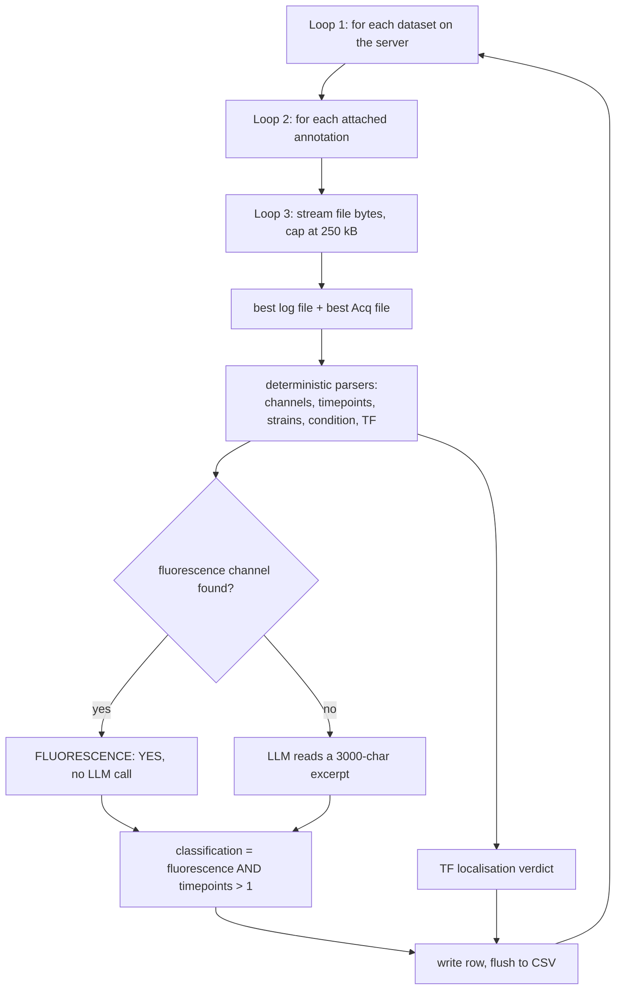

# EXP-26-IY026 — OMERO fluorescence time-lapse survey

Scans **every dataset on the lab OMERO server** (`staffa.bio.ed.ac.uk`), reads the log /
acquisition text files attached to each one, and writes one row per dataset to
`results.csv` answering two questions:

1. **Is this a fluorescence time-lapse experiment?** (`classification`)
2. **Is a transcription factor being tracked?** (`is_tf_localisation`)

Alongside the verdicts it extracts the metadata needed to decide which datasets are worth
re-analysing: the TF(s) imaged, the strain IDs, the media-switch condition, the number of
timepoints and the fluorescence channels.

The design rule throughout: **regexes and the strain database do the work; the LLM is only
ever a fallback** when deterministic parsing comes up empty. On the last full run only a
minority of datasets needed the model at all.

---

## Running it

Requires the **alibylite** environment (it provides `omero-py`), not `stochastic_sim`:

```bash
cd experiments/EXP-26-IY026
/home/ianyang/micromamba/envs/alibylite/bin/python3 find_fluorescence_timelapse.py

# useful variants
... --limit 20                  # smoke-test on the first 20 datasets
... --output results_v2.csv     # write elsewhere
... --resume                    # append to results.csv, skipping dataset IDs already in it
... --model gpt-5.4             # override the fallback model
```

Credentials and paths live in `.env` (git-ignored) next to this file:

```ini
OPENAI_API_KEY=...      # optional
OMERO_HOST=staffa.bio.ed.ac.uk
OMERO_USER=upload
OMERO_PASSWORD=...
```

**The OpenAI key is optional.** Without one the run warns and proceeds on the deterministic
parsers alone: every column is still produced, but the four LLM fallbacks never fire, so
datasets that need the model to resolve a field leave it empty. `provenance` records this as
`none`, or `no-model` for the fluorescence verdict.

A full run takes a few hours (~1800 datasets, ~2–5 s each) and streams to `results.csv`
row by row, so a crash never loses completed work — restart with `--resume`.

`--resume` is only safe when the existing `results.csv` was produced by the *same* parser
version; otherwise old rows carry stale logic.

---

## What comes out — `results.csv` columns

| Column | Meaning |
| --- | --- |
| `dataset_id`, `dataset_name` | OMERO identifiers |
| `has_log` | whether any log/acquisition text was attached at all |
| `condition` | the media switch, e.g. `0.5% glucose to 0% glucose`; **empty means no switch** |
| `strain_id` | every strain/group identifier found, `;`-joined |
| `tf_identity` | TF(s) imaged, or `UNKNOWN` |
| `timepoints` | number of timepoints acquired |
| `classification` | fluorescence time-lapse: `YES` / `NO` / `ERROR` |
| `is_tf_localisation` | TF localisation experiment: `YES` / `NO` / `UNKNOWN` |
| `tf_localisation_reason` | one sentence justifying the TF verdict |
| `reason` | one sentence justifying the fluorescence verdict |
| `channels` | fluorescence channels only |
| `all_channels` | every channel acquired, brightfield included |
| `provenance` | which link of each fallback chain produced each field |
| `raw_llm_response` | every LLM reply this dataset triggered, labelled by call |

Last full run: **1825 datasets — 1464 fluorescence time-lapse, 331 TF localisation, 132
with no metadata attached.**

### Reading `provenance`

Every field is the output of a fallback chain, and how far to trust it depends on which
link fired — a TF read off a Batgirl group label is not the same evidence as one the model
inferred from prose. The column records that for all five verdicts:

```text
condition=switch-phrase | strain=details | tf=group-labels | fluorescence=parsed-channels | tf_localisation=known-tf
```

First-hit chains name one source; merged chains name every contributor
(`tf=details,tagged-proteins`). `none` means nothing produced a value. Filtering on
`tf=llm` or `condition=llm` isolates the rows resting on the model rather than on a parse.

---

## The loops

There are three real loops, and four *fallback chains* which is where most of the apparent
complexity lives. Everything below happens inside the outer loop of `pipeline.run`.



**Loop 1 — datasets** (`pipeline.run`). Fetches all dataset IDs up front, drops any
already in `results.csv` when resuming, then processes them one at a time. Each iteration
is wrapped in `try/except`: a dataset that fails is written as an `ERROR` row and the run
carries on. The row is flushed to disk immediately, then a 0.2 s pause keeps the LLM API
happy.

**Loop 2 — annotations** (`omero_source.read_metadata_annotations`). A dataset can have
many attachments. Only `.log` and `.txt` files are considered; each is scored by priority
and the single best log file and best acquisition file are kept:

| Priority | Log file | Acquisition file |
| --- | --- | --- |
| 1 | contains the Swain Lab header or section titles | filename ends `acq.txt` |
| 2 | filename ends `log.txt` (old multiDGUI) | contains ≥2 of `Channels:` / `Time_settings:` / `Points:` |
| 3 | filename ends `.log` (newer Batgirl) | — |
| 4 | any other `.txt` | — |

Old multiDGUI experiments split their metadata across two files (`*log.txt` for the
experiment description, `*Acq.txt` for the settings tables); newer ones put everything in
one `.log`. Both get read, and both get concatenated into the text the parsers see.

**Loop 3 — file chunks** (`_read_file_annotation_text`). Annotations are streamed and cut
off at 250 kB so a multi-MB run log can't stall the survey. Acquisition settings sit near
the top of these files, so truncation costs nothing — but it is recorded in the `reason`
column as `Metadata truncated: <filename>`.

---

## The four fallback chains

Each extracted field walks its chain from most to least trustworthy and stops at the first
hit. The LLM is always the last link.

### 1. TF identity — `parse_tf.parse_tf_from_groups`

This is the one chain that is part ranking, part merge.

| # | Source | Example | |
| --- | --- | --- | --- |
| 1 | Batgirl `group:` labels | `ch1_REI1`, `ACE2_ch17`, `Msn2_GFP`, `Dot6` | short-circuits |
| 2 | `strain_tf_database.csv` | group `898` → `Msn2`, `Mig1` | short-circuits |
| 3 | the `Strain:` field / strain sentence in *Experiment details* | `Strain: Mig1, Dot6, Maf1` → all three | merged |
| 4 | position names | `Dot6_001`, `Hog1_001` → `Dot6`, `Hog1` | merged |
| 5 | the dataset name | `Ramp_..._Msn2Dot6Mig1_00` → `Msn2`, `Dot6`, `Mig1` | merged |
| 6 | tagged-protein constructs in free text | `Msn2-GFP`, `Dot6-mCherry2`, `htb2::mCherry` | merged |
| 7 | LLM on the first 1000 chars | — | last resort |

Source 1 is the strongest evidence in the log — the acquisition software writes one label
per imaged chamber — and the lab has written those labels several ways. `ch1_REI1`,
`ACE2_ch17` and `ch10_C11_RPS18A` need no vocabulary, since everything in them except the
gene is positional (a chamber number, and on the plate screens the source well); `Msn2_GFP`
and `Dot6` are matched against the catalogued proteins so that tags cannot be read as TFs.
Reading only `ch1_REI1`, and only in upper case, resolved 5 of the 70 datasets carrying
group labels in a 220-dataset sample; all the shapes together resolve 18.

Telling the well from the gene matters: a well is one letter and a number, a gene name is
longer. Taking the first token after the chamber made the aggregation screens
(datasets 1666–2462) report `C11` and `A1` as transcription factors.

Sources 1 and 2 enumerate one TF per imaged chamber, so the first that hits wins outright.
Sources 3–6 are each only a partial view of the same strain list, so they are merged, most
specific first. None is reliably complete on its own: the `Strain:` field lists strains the
filename has no room for and needs no fluorescent tag to be written
(`Strain: 87 (Msn2-GFP), 416 (Hog1), 424 (Dot6)` yields all three), while the OMERO tag
line at the foot of the log often records a strain the `Strain:` field abbreviated or
mistyped — dataset 831 writes `Sfp1-GFP/` in the field and `Sfp1-GFP/Mig1-mCherry` in the
tags.

Position names sit in the merged group rather than with the group labels precisely because
they are typed by hand and need not name the reporter: dataset 823's positions are named
after its AID-tagged degradation targets, while the imaged reporters Mig1-mCherry and
Msn2-mCherry appear only in the `Strain:` field.

Merging is safe because sources 3–6 only accept catalogued protein names
(`vocabulary.py`, 165 confirmed TFs from IY008 plus extras seen here), so arbitrary gene
names never leak in. Nothing found → `UNKNOWN`.

One consequence worth knowing: when a screen labels its chambers, a reporter common to
*every* chamber is dropped. Dataset 926 images 19 TF chambers all carrying Msn2-mCherry as
a switch-timing marker; `tf_identity` lists the 19 screened TFs, not Msn2.

### 2. Channels — `parse_channels.parse_channels`

Unlike the others this one runs *all four* extractors and merges the results, because the
log format changed several times:

- `parse_acq_channels` — the old multiDGUI `Channels:` CSV table
- `parse_image_config_channels` — the newer `Image Config,Channel,...` block
- `parse_setup_channels` — the `Microscope setup for used channels:` sub-headings
- `parse_runtime_channels` — per-frame lines such as `Channel: GFP`

Two of these used to run past their own data. `parse_runtime_channels` matched any line
starting with "Channel", so `Channel does not use Smart EM camera mode.` registered a
channel called `does` in 127 of 220 sampled datasets; it now requires the colon.
`parse_image_config_channels` ended its block at a blank line, but these logs follow the
table straight on with `Device properties:`, a second `Image config,...` table and then the
position list, so stage coordinates and position names were reaching the channel column; it
now ends the block when the column count stops matching the header. A name-shape guard
catches anything else that slips through.

`fluorescence_channels()` then filters the merged list against `FLUORESCENCE_CHANNELS`,
dropping the transmitted-light channels named in `BRIGHTFIELD_CHANNELS`. Matching is exact
first, then substring, so `GFP_1` still resolves.

### 3. Condition — `parse_experiment.parse_condition`

1. Cut out the `Experiment details:` block (`parse_experiment_details`).
2. Regex for `switch from X to Y` → `"X to Y"`. Both sides are length-capped, or an
   unpunctuated block lets `Y` run to the end of the text.
3. If the details state outright that nothing was switched, stop — and skip the LLM call.
4. Otherwise the LLM, on the first 500 chars of the details, asked for a terse `X to Y`.

**An empty `condition` means there was no media switch**, which is the right answer for
most experiments here: only 470 of 1710 datasets with a log mention a switch at all. An
earlier version fell back to returning the first sentence of the details, which filled 55%
of the column with the experiment's *aim* (`Aim: Measure growth rate in raffinose`)
presented as its condition.

### 4. Timepoints — `parse_experiment.parse_timepoints`

1. The 3rd field of the multiDGUI `Time_settings:` row.
2. Explicit declarations: `Number of timepoints = 180`, `ntimepoints: 7`, `frames: 12`,
   `time point 5 of 180`.
3. Failing both, the highest `--- Time point N ---` progress line in the log.

---

## Reading the *Experiment details* block

`parse_experiment_details` cuts the experimenter-written block out of the log and drops
the `Microscope setup for used channels:` configuration dump that follows it. Both the
strain and the condition chains work from that text, so config filenames and filter-set
numbers can never be read as experimental values.

Strains are described in one of two ways, and the structured form always wins:

| Form | Example | What is trusted |
| --- | --- | --- |
| `Strain:` field | `Strain: 78 (BY4742), 1579 (BY4742 Morgan)` | every bare 2–4 digit number in the field |
| prose sentence | `Strains are 87 (msn2-GFP) and 1138 (msn2-mCherry).` | only numbers carrying a `(...)` description |

Prose is read only when the `Strain:` field is absent or blank. Logs that have the field
already carry an authoritative list, and their fields and comments frequently run together
into one unpunctuated "sentence" — dataset 907's `Strain: none … guage 25 (red)` would
otherwise report strain 25.

The numeric guards exist because the details block is full of numbers that are not strain
IDs. A strain number is 2–4 digits, has no leading zero, and is not glued to a letter,
digit, underscore or hyphen — which rules out background-strain names (`BY4741`, `W303`,
`CBS138`), position ranges (`pos001-006`), device codes (`5_75`) and concentrations
(`100ug/ml`). A parenthesis attached directly to a gene name is a residue range rather
than an annotation, so `Msn2(604-636)` contributes nothing while `429(Yap1)` gives 429.
`YST_1490` / `YST1490` / `YST-708` / `yst365` are all reduced to the bare number, as is a
`YST` number carrying more of the strain's description after it: `YST_87_BY4741` is strain
87 in the BY4741 background, and `YST_247_001` is position 1 of strain 247.

---

## The two verdicts

**`classification` (fluorescence time-lapse)** = fluorescence **AND** `timepoints > 1`.
Fluorescence is decided in one of three ways: no metadata attached → `NO`; a fluorescence
channel parsed → `YES` with no LLM call; otherwise the LLM reads a 3000-character excerpt
(split evenly between the log and acquisition files when both exist) and replies in a
fixed three-line format that is parsed back out.

**`is_tf_localisation`** — `classification.classify_tf_localisation`:

1. Strain ID in `strain_tf_database.csv` → `YES` (highest confidence).
2. Any detected protein in `KNOWN_TFS` → `YES`.
3. All detected proteins in `KNOWN_NON_TF_MARKERS` (histones, organelle markers,
   stress-granule proteins, metabolic enzymes) → `NO`.
4. Otherwise the LLM, given the dataset name plus 1500 characters, with a prompt spelling
   out what does and does not count.

So a dataset can be `classification=YES, is_tf_localisation=NO` — fluorescent, time-lapse,
but imaging something that is not a TF.

Step 3 is reachable only through group labels, which are the one TF source not filtered
against `KNOWN_TFS`: every other source gates on it, so a non-TF marker can never arrive
from them. `group: ch1_VPH1` is what makes a vacuole-marker dataset resolve deterministically.

Worst case a dataset costs four LLM calls (condition, TF identity, fluorescence, TF
localisation); the common case is zero or one. Every reply is kept in `raw_llm_response`,
labelled by call, so a model that answered `UNKNOWN` or timed out leaves a trace —
previously only the fluorescence reply was recorded and the other three were invisible.

---

## Files

```text
find_fluorescence_timelapse.py     entry point: argument parsing only
fluorescence_survey/
    config.py                      all settings + credentials, .env-overridable
    omero_source.py                connection, dataset listing, annotation reading
    vocabulary.py                  channel names, KNOWN_TFS, non-TF markers
    strain_db.py                   strain_tf_database.csv lookup
    utils.py                       dedupe helper + `Parsed` (value plus provenance)
    parse_channels.py              chain 2
    parse_experiment.py            chains 3 and 4 + the details block and strain IDs
    parse_tf.py                    chain 1
    llm.py                         OpenAI client, call transcript, reply parsing
    classification.py              the two verdicts, assembles the CSV row
    pipeline.py                    the run loop
    tests/                         pytest suite for the parsers
strain_tf_database.csv             curated group_id → TF map (14 groups)
results.csv                        output
find_fluorescence_timelapse.log    run log
IY026_fluorescence_exp_overview.ipynb   downstream analysis of results.csv
```

`omero_source.py` is the only module that touches the network for OMERO; `llm.py` the only
one that touches OpenAI, and it imports the SDK lazily. Everything else is pure text in,
values out, and can be imported and tested without either:

```bash
/home/ianyang/micromamba/envs/alibylite/bin/python3 -m pytest fluorescence_survey/tests/ -q
```

---

## Known caveats

- **An empty `condition` is an answer, not a gap** — it means no media switch was
  described. Check `provenance` to tell `no-switch-stated` (the log says so) from `none`
  (nothing was found, including by the model).
- **`strain_id` mixes numbers and labels** — numeric group IDs, numbers parsed out of the
  Experiment details, YST numbers from position names, the raw `Strain:` field labels and
  `group 1: by4741` position labels, all `;`-joined in one column. Numeric IDs are emitted
  first and are the only ones that join to `strain_tf_database.csv`, so
  `strain_id.split(";")` then keeping the entries matching `^\d+$` gives the joinable set.
- **Calibration and test datasets pass the fluorescence filter.** A graticule slide imaged
  in `BrightfieldGFP` over 180 frames scores `classification=YES`; the rule tests only
  "fluorescence + >1 timepoint", not whether cells were present. `is_tf_localisation`
  correctly rejects them, so filter on both columns.
- **Substring channel matching is deliberately loose.** `BrightfieldGFP` counts as
  fluorescence because it contains `GFP`.
- **`cy5` is both a reporter and a tracer dye and cannot be told apart from the log.**
  In dataset 1112 it images a HaloTag; in dataset 832 it is the dye used to calibrate flow
  in a growth experiment. 86 datasets have it as their only fluorescence channel and all
  score `classification=YES`.
- **Timepoints can be undercounted** for truncated logs when the count comes from progress
  lines (fallback 3) rather than a declared total.
