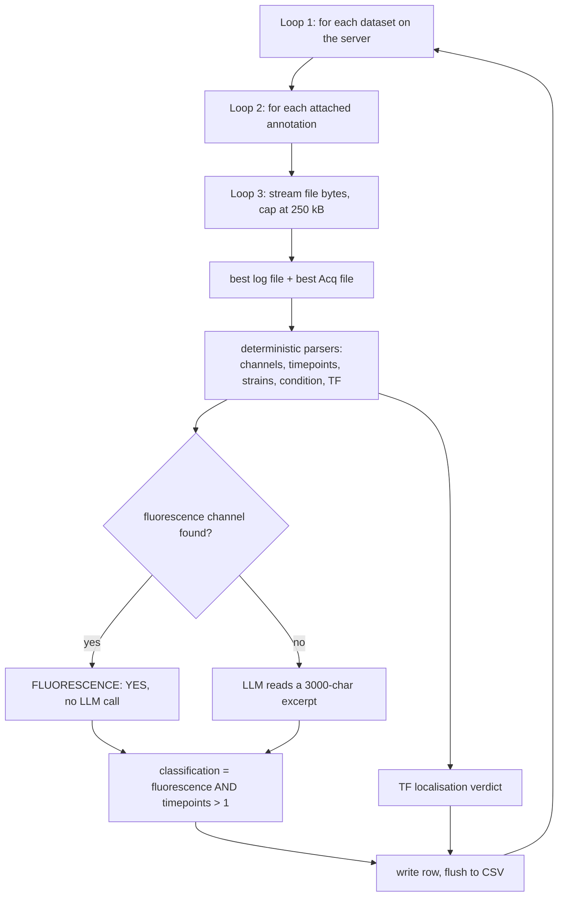

# EXP-26-IY026 — OMERO fluorescence time-lapse survey

Scans **every dataset on the lab OMERO server** (`staffa.bio.ed.ac.uk`), reads the log /
acquisition text files attached to each one, and writes one row per dataset to
`results.csv` answering two questions:

1. **Is this a fluorescence time-lapse experiment?** (`classification`)
2. **Is a transcription factor being tracked?** (`is_tf_localisation`)

Alongside the verdicts it extracts the metadata needed to decide which datasets are worth
re-analysing: the TF(s) imaged, the strain IDs, the media-switch condition, the number of
timepoints and the fluorescence channels.

The design rule throughout: **regexes and the strain database do the work; the LLM is only
ever a fallback** when deterministic parsing comes up empty. On the last full run only a
minority of datasets needed the model at all.

---

## Running it

Requires the **alibylite** environment (it provides `omero-py`), not `stochastic_sim`:

```bash
cd experiments/EXP-26-IY026
/home/ianyang/micromamba/envs/alibylite/bin/python3 find_fluorescence_timelapse.py

# useful variants
... --limit 20                  # smoke-test on the first 20 datasets
... --output results_v2.csv     # write elsewhere
... --resume                    # append to results.csv, skipping dataset IDs already in it
... --model gpt-5.4             # override the fallback model
```

Credentials and paths live in `.env` (git-ignored) next to this file:

```ini
OPENAI_API_KEY=...
OMERO_HOST=staffa.bio.ed.ac.uk
OMERO_USER=upload
OMERO_PASSWORD=...
```

A full run takes a few hours (~1800 datasets, ~2–5 s each) and streams to `results.csv`
row by row, so a crash never loses completed work — restart with `--resume`.

`--resume` is only safe when the existing `results.csv` was produced by the *same* parser
version; otherwise old rows carry stale logic.

---

## What comes out — `results.csv` columns

| Column | Meaning |
| --- | --- |
| `dataset_id`, `dataset_name` | OMERO identifiers |
| `has_log` | whether any log/acquisition text was attached at all |
| `condition` | the media switch, e.g. `0.5% glucose to 0% glucose` |
| `strain_id` | every strain/group identifier found, `;`-joined |
| `tf_identity` | TF(s) imaged, or `UNKNOWN` |
| `timepoints` | number of timepoints acquired |
| `classification` | fluorescence time-lapse: `YES` / `NO` / `ERROR` |
| `is_tf_localisation` | TF localisation experiment: `YES` / `NO` / `UNKNOWN` |
| `tf_localisation_reason` | one sentence justifying the TF verdict |
| `reason` | one sentence justifying the fluorescence verdict |
| `channels` | fluorescence channels detected |
| `raw_llm_response` | the unparsed fluorescence reply, for auditing |

Last full run: **1825 datasets — 1464 fluorescence time-lapse, 331 TF localisation, 132
with no metadata attached.**

---

## The loops

There are three real loops, and four *fallback chains* which is where most of the apparent
complexity lives. Everything below happens inside the outer loop of `pipeline.run`.



**Loop 1 — datasets** (`pipeline.run`). Fetches all dataset IDs up front, drops any
already in `results.csv` when resuming, then processes them one at a time. Each iteration
is wrapped in `try/except`: a dataset that fails is written as an `ERROR` row and the run
carries on. The row is flushed to disk immediately, then a 0.2 s pause keeps the LLM API
happy.

**Loop 2 — annotations** (`omero_source.read_metadata_annotations`). A dataset can have
many attachments. Only `.log` and `.txt` files are considered; each is scored by priority
and the single best log file and best acquisition file are kept:

| Priority | Log file | Acquisition file |
| --- | --- | --- |
| 1 | contains the Swain Lab header or section titles | filename ends `acq.txt` |
| 2 | filename ends `log.txt` (old multiDGUI) | contains ≥2 of `Channels:` / `Time_settings:` / `Points:` |
| 3 | filename ends `.log` (newer Batgirl) | — |
| 4 | any other `.txt` | — |

Old multiDGUI experiments split their metadata across two files (`*log.txt` for the
experiment description, `*Acq.txt` for the settings tables); newer ones put everything in
one `.log`. Both get read, and both get concatenated into the text the parsers see.

**Loop 3 — file chunks** (`_read_file_annotation_text`). Annotations are streamed and cut
off at 250 kB so a multi-MB run log can't stall the survey. Acquisition settings sit near
the top of these files, so truncation costs nothing — but it is recorded in the `reason`
column as `Metadata truncated: <filename>`.

---

## The four fallback chains

Each extracted field walks its chain from most to least trustworthy and stops at the first
hit. The LLM is always the last link.

### 1. TF identity — `parse_tf.parse_tf_from_groups`

| # | Source | Example |
| --- | --- | --- |
| 1 | Batgirl group labels in the log | `group: ch1_REI1` → `Rei1` |
| 2 | `strain_tf_database.csv` | group `898` → `Msn2`, `Mig1` |
| 3 | the dataset name | `Ramp_..._Msn2Dot6Mig1_00` → `Msn2`, `Dot6`, `Mig1` |
| 4 | tagged-protein constructs in free text | `Msn2-GFP`, `Dot6-mCherry2` |
| 5 | LLM on the first 1000 chars | — |

Steps 3 and 4 only accept names present in `KNOWN_TFS` (`vocabulary.py`, 163 confirmed TFs
from IY008 plus extras seen here), so arbitrary gene names never leak in. Nothing
found → `UNKNOWN`.

### 2. Channels — `parse_channels.parse_channels`

Unlike the others this one runs *all four* extractors and merges the results, because the
log format changed several times:

- `parse_acq_channels` — the old multiDGUI `Channels:` CSV table
- `parse_image_config_channels` — the newer `Image Config,Channel,...` block
- `parse_setup_channels` — the `Microscope setup for used channels:` sub-headings
- `parse_runtime_channels` — per-frame lines such as `Channel: GFP`

`fluorescence_channels()` then filters the merged list against `FLUORESCENCE_CHANNELS`,
dropping brightfield. Matching is exact first, then substring, so `GFP_1` still resolves.

### 3. Condition — `parse_experiment.parse_condition`

1. Cut out the `Experiment details:` block.
2. Regex for `switch from X to Y` → `"X to Y"`. Covers most datasets.
3. LLM on the first 500 chars of the details, asked for a terse `X to Y` phrase.
4. Otherwise the first sentence of the details, capped at 200 characters.

### 4. Timepoints — `parse_experiment.parse_timepoints`

1. The 3rd field of the multiDGUI `Time_settings:` row.
2. Explicit declarations: `Number of timepoints = 180`, `ntimepoints: 7`, `frames: 12`,
   `time point 5 of 180`.
3. Failing both, the highest `--- Time point N ---` progress line in the log.

---

## The two verdicts

**`classification` (fluorescence time-lapse)** = fluorescence **AND** `timepoints > 1`.
Fluorescence is decided in one of three ways: no metadata attached → `NO`; a fluorescence
channel parsed → `YES` with no LLM call; otherwise the LLM reads a 3000-character excerpt
(split evenly between the log and acquisition files when both exist) and replies in a
fixed three-line format that is parsed back out.

**`is_tf_localisation`** — `classification.classify_tf_localisation`:

1. Strain ID in `strain_tf_database.csv` → `YES` (highest confidence).
2. Any detected protein in `KNOWN_TFS` → `YES`.
3. All detected proteins in `KNOWN_NON_TF_MARKERS` (histones, organelle markers,
   stress-granule proteins, metabolic enzymes) → `NO`.
4. Otherwise the LLM, given the dataset name plus 1500 characters, with a prompt spelling
   out what does and does not count.

So a dataset can be `classification=YES, is_tf_localisation=NO` — fluorescent, time-lapse,
but imaging something that is not a TF.

Worst case a dataset costs four LLM calls (condition, TF identity, fluorescence, TF
localisation); the common case is zero or one.

---

## Files

```text
find_fluorescence_timelapse.py     entry point: argument parsing only
fluorescence_survey/
    config.py                      all settings + credentials, .env-overridable
    omero_source.py                connection, dataset listing, annotation reading
    vocabulary.py                  fluorescence channels, KNOWN_TFS, non-TF markers
    strain_db.py                   strain_tf_database.csv lookup
    parse_channels.py              chain 2
    parse_experiment.py            chains 3 and 4 + strain IDs
    parse_tf.py                    chain 1
    llm.py                         OpenAI client + structured-reply parsing
    classification.py              the two verdicts, assembles the CSV row
    pipeline.py                    the run loop
strain_tf_database.csv             curated group_id → TF map (14 groups)
results.csv                        output
find_fluorescence_timelapse.log    run log
IY026_fluorescence_exp_overview.ipynb   downstream analysis of results.csv
```

`omero_source.py` is the only module that touches the network for OMERO; `llm.py` the only
one that touches OpenAI. Everything else is pure text in, values out, and can be tested
without either.

---

## Known caveats

- **`condition` is noisy when the regex misses.** The step-4 fallback returns the first
  "sentence" of the details block, which for logs without punctuation can be a multi-line
  blob including the `Microscope setup` heading. Filter this column before analysis.
- **`strain_id` mixes four kinds of identifier** — numeric group IDs, `YST_` numbers, the
  free-text `Strain:` field and `group 1: by4741` position labels — all `;`-joined in one
  column. Only the numeric ones join to `strain_tf_database.csv`.
- **Calibration and test datasets pass the fluorescence filter.** A graticule slide imaged
  in `BrightfieldGFP` over 180 frames scores `classification=YES`; the rule tests only
  "fluorescence + >1 timepoint", not whether cells were present. `is_tf_localisation`
  correctly rejects them, so filter on both columns.
- **Substring channel matching is deliberately loose.** `BrightfieldGFP` counts as
  fluorescence because it contains `GFP`.
- **Timepoints can be undercounted** for truncated logs when the count comes from progress
  lines (fallback 3) rather than a declared total.
- **`raw_llm_response` only records the fluorescence call**, not the other three.
